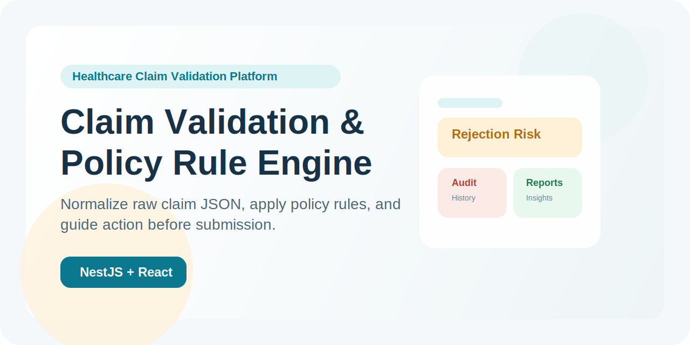

# Claim Validation & Policy Rule Engine



A full-stack healthcare claims review system that helps teams validate claim data against insurance policy rules before submission.

It accepts raw claim JSON and raw policy JSON, normalizes both into a standard internal format, runs rule checks, and returns a plain-language outcome that operations teams can act on.

## Project Tagline

Normalize claim data from different portals, validate it against policy rules, and give operations teams an explainable decision before submission.

## Suggested Repository Name

`claim-validation-policy-rule-engine`

## Suggested GitHub Description

Full-stack healthcare claim validation platform with JSON normalization, rule engine evaluation, audit history, and reporting.

## What This Project Does

- Accepts different claim JSON formats from hospital portals or reimbursement systems
- Accepts claim PDFs and extracts text before parsing into structured claim JSON
- Accepts different policy JSON formats from insurer or policy systems
- Normalizes the raw data automatically into default internal fields
- Runs built-in policy checks like room rent, treatment coverage, waiting period, and duplicate charge review
- Supports dynamic `customRules` from policy JSON
- Shows results in a React frontend designed for non-technical users
- Maintains browser-side audit history and review reporting in the UI

## Who It Is For

- Claims operations teams
- Healthcare finance teams
- QA and audit teams
- Product or business users who need to understand claim rejection risk without reading code

## How It Works

```text
Raw Claim JSON + Raw Policy JSON
              |
              v
      Normalization Layer
              |
              v
     Rule Engine Evaluation
              |
              v
  Status + Issues + Normalized Output
              |
              v
Frontend Views:
- Claim Review
- Audit History
- Policy Rules
- Reports
```

PDF ingestion flow:

```text
PDF Upload
   ↓
Text Extraction Layer
   ↓
Raw OCR/Text
   ↓
Claim Parsing Logic
   ↓
Structured Claim JSON
   ↓
Normalization + Rule Engine
```

## Main Features

### Backend

- NestJS + TypeScript backend
- DTO validation for request shape
- Automatic normalization of raw claim and policy JSON
- Built-in rule engine for common claim checks
- Dynamic policy-driven rules via `customRules`
- Explainable response with normalized payloads and inferred mappings

### Frontend

- React + Vite frontend
- Responsive dashboard UI
- Simple claim review workflow for non-technical users
- Claim source toggle for JSON or PDF
- Audit history view for review trail
- Policy rules view for explainability
- Reports view for operational insights

## Key User Benefits

- Reduces manual claim review effort
- Detects rejection risk before claim submission
- Explains validation outcomes in non-technical language
- Helps audit teams trace what happened in each review run
- Makes different hospital and insurer payloads usable without forcing one fixed schema

## Built-In Rules

- `room_rent_limit`
- `coverage_rule`
- `waiting_period_rule`
- `duplicate_charge_rule`

## Request Format

Send both JSON payloads directly in the request body:

```json
{
  "claim": { "...raw claim json..." },
  "policy": { "...raw policy json..." }
}
```

`claim` and `policy` can both be arbitrary JSON structures.

The backend first normalizes them and then runs the validation rules.

## Example Response

```json
{
  "status": "REJECTION_RISK",
  "summary": {
    "totalRules": 6,
    "passed": 3,
    "failed": 2,
    "warnings": 1
  },
  "issues": [
    {
      "rule": "room_rent_limit",
      "status": "FAIL",
      "message": "Room rent exceeds the allowed limit."
    }
  ],
  "resolvedMappings": {},
  "mappingSources": {},
  "normalizedClaim": {},
  "normalizedPolicy": {}
}
```

## Project Structure

```text
data-reconciliation-platform/
├── frontend/              # React frontend
├── src/                   # NestJS backend
│   ├── modules/
│   │   ├── claim/
│   │   ├── comparator/
│   │   ├── normalizer/
│   │   ├── pipeline/
│   │   ├── policy/
│   │   └── rule-engine/
│   ├── common/
│   └── app.module.ts
├── scripts/
├── test/
├── docs/
├── README.md
└── package.json
```

## Local Setup

### 1. Install dependencies

```bash
npm install
npm --prefix frontend install
```

### 2. Create environment file

```bash
cp .env.example .env
```

### 3. Start the backend

```bash
npm run start:dev
```

### 4. Start the frontend

In another terminal:

```bash
npm run frontend:dev
```

### 5. Open the app

Frontend:

`http://localhost:5173`

Backend:

`http://localhost:3000`

## API

### Validate a claim

```bash
curl -X POST http://localhost:3000/validate-claim \
  -H "Content-Type: application/json" \
  -d @scripts/sample-claim.json
```

### Parse a claim PDF

```bash
curl -X POST http://localhost:3000/parse/claim-pdf \
  -F "claimDocument=@/absolute/path/to/claim.pdf;type=application/pdf"
```

### Parse a policy PDF

```bash
curl -X POST http://localhost:3000/parse/policy-pdf \
  -F "policyDocument=@/absolute/path/to/policy.pdf;type=application/pdf"
```

### Validate a claim using claim/policy PDFs or JSON

```bash
curl -X POST http://localhost:3000/validate-claim/document \
  -F "claimDocument=@/absolute/path/to/claim.pdf;type=application/pdf" \
  -F "policyJson=$(cat scripts/sample-policy.json)"
```

You can mix formats:

- claim PDF + policy JSON
- claim JSON + policy PDF
- claim PDF + policy PDF
- claim JSON + policy JSON using the original `/validate-claim`

The document validation endpoint:

- extracts readable text from the PDF
- parses common claim fields into structured JSON
- parses common policy fields into structured JSON
- supports OCR fallback for scanned/image PDFs
- runs the same normalization and rule engine pipeline
- returns normal validation output plus `ingestion` metadata

## Frontend Screens

The frontend is organized into four views:

- `Claim Review`: upload claim and policy JSON and run validation
- `Audit History`: see previous review runs and what changed
- `Policy Rules`: understand built-in and custom rules
- `Reports`: review trends, workload, and common issues

## Screenshots

Add screenshots after publishing to make the repository easier to scan.

Suggested screenshots:

1. Claim Review dashboard
2. Audit History timeline
3. Policy Rules view
4. Reports dashboard

Example section format:

```md
## Screenshots

### Claim Review


### Audit History

```

Recommended filenames:

- `docs/screenshots/claim-review.png`
- `docs/screenshots/audit-history.png`
- `docs/screenshots/policy-rules.png`
- `docs/screenshots/reports-dashboard.png`

## Sample Data

Use:

- [scripts/sample-claim.json](/Users/ashishsingh/Documents/newProjects/data-reconciliation-platform/scripts/sample-claim.json)

## Validation Output

The backend response can include:

- `status`
- `summary`
- `issues`
- `ruleResults`
- `resolvedMappings`
- `mappingSources`
- `normalizedClaim`
- `normalizedPolicy`
- `matchedContext`
- `ingestion`

## Scripts

```bash
npm run build
npm run test
npm run start:dev
npm run frontend:dev
npm run frontend:build
```

## Documentation

- [Project Walkthrough](/Users/ashishsingh/Documents/newProjects/data-reconciliation-platform/docs/project-walkthrough.md)
- [GitHub Publish Guide](/Users/ashishsingh/Documents/newProjects/data-reconciliation-platform/docs/github-publish.md)
- [Sharing Copy](/Users/ashishsingh/Documents/newProjects/data-reconciliation-platform/docs/sharing-copy.md)
- [Screenshot Guide](/Users/ashishsingh/Documents/newProjects/data-reconciliation-platform/docs/screenshots/README.md)
- [Repo Branding Guide](/Users/ashishsingh/Documents/newProjects/data-reconciliation-platform/docs/repo-branding.md)

## Notes Before Publishing

- `.env` is ignored and should not be committed
- `node_modules`, `dist`, and frontend build output are ignored
- SQLite files are ignored
- You can keep the GitHub repo public or private

## Author

Ashish Kumar Singh

## Contributing

Contributions are welcome.

Suggested contribution flow:

1. Fork the repository
2. Create a feature branch
3. Make your changes
4. Run tests and builds
5. Open a pull request with a clear summary

Before opening a PR, run:

```bash
npm run build
npm run test
npm run frontend:build
```

## License

This project is licensed under the MIT License.

See [LICENSE](/Users/ashishsingh/Documents/newProjects/data-reconciliation-platform/LICENSE).
